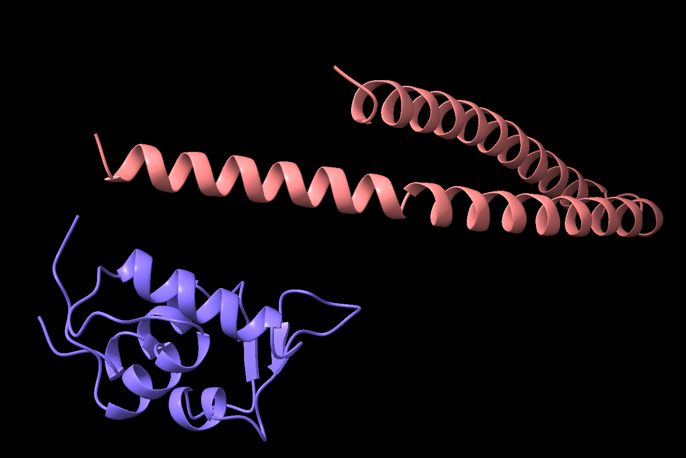

# Experiment 2A: Hotspot-Guided MDM2 Binder Design

Date: 2026-05-31

## Objective

To test whether hotspot-guided RFdiffusion binder design can generate a de novo binder against the MDM2 p53-binding pocket.

This experiment is different from motif scaffolding. Instead of preserving the native p53 helix, the goal was to generate a new binder directly against selected MDM2 hotspot residues.

---

## Configuration

Input structure:

- PDB: `1YCR`
- Target chain: `A`
- Target protein: MDM2

Contig:

```text
A:70-100
```

Hotspots:

```text
A54,A61,A62,A67,A86,A91
```

Interpretation:

- MDM2 chain `A` was used as the target.
- Residues `A54`, `A61`, `A62`, `A67`, `A86`, and `A91` were provided as hotspot residues.
- RFdiffusion was expected to generate a binder that contacts the MDM2 p53-binding pocket.

---

## Sequence Design and Validation

For the generated RFdiffusion backbones:

- ProteinMPNN generated candidate binder sequences.
- AlphaFold validation was used to evaluate whether the designed sequence formed a stable target-binder complex.
- Candidate ranking was based on pLDDT, interface pTM, interface PAE, and RMSD.

Overall, the MPNN/AlphaFold validation results were poor for binder design.

Summary of `mpnn_results.csv`:

| Metric | Best / lowest | Worst / highest | Mean | Interpretation |
| --- | ---: | ---: | ---: | --- |
| pLDDT | `0.917` | `0.727` | `0.848` | Some binders may fold locally |
| interface pTM | `0.165` | `0.068` | `0.094` | Very weak interface confidence |
| interface PAE | `22.15` | `27.76` | `26.26` | Poor target-binder relative orientation |
| RMSD | `10.35` | `50.69` | `26.91` | AlphaFold predictions diverged strongly |

Best candidate by interface PAE and interface pTM:

| Design | Sequence | pLDDT | interface pTM | interface PAE | RMSD |
| --- | --- | ---: | ---: | ---: | ---: |
| `1` | `0` | `0.887` | `0.165` | `22.15` | `23.57` |

Although this candidate had reasonable pLDDT, the interface metrics were not acceptable for a successful binder.

---

## Structural Result

The generated binder did not form a stable complex with MDM2 in AlphaFold validation.

The predicted binder was positioned far from the MDM2 surface, and the inter-chain PAE was high, indicating low confidence in the target-binder relative orientation.



Figure 1. Best model from Experiment 2A. The binder does not form a confident complex with MDM2.

---

## Interpretation

Hotspot conditioning alone was insufficient to produce a confident MDM2-binding pose in this run.

The result suggests that the generated binder may be foldable as an isolated protein, but it should not be interpreted as a successful MDM2 binder.

Key interpretation:

```text
Binder local fold confidence: PARTIAL PASS

Target-binder complex formation: FAIL

Interface confidence: FAIL
```

The main failure mode is not simply poor folding. Instead, AlphaFold did not support a stable relative orientation between the generated binder and MDM2.

---

## Notes

- pLDDT values were not uniformly terrible, which means some generated sequences may have plausible local folds.
- However, interface pTM values were extremely low.
- Interface PAE values were consistently high, around `22-28 Å`.
- RMSD values were also high, suggesting that AlphaFold did not recover the intended RFdiffusion complex geometry.
- Therefore, the overall MPNN results should be considered poor for the purpose of MDM2 binder design.

---

## Next Steps

Potential improvements:

1. Try a different hotspot set focused more tightly on the MDM2 hydrophobic cleft.
2. Generate a larger binder library before filtering.
3. Add stronger target-aware constraints or use a target-conditioned protocol.
4. Compare against motif-based strategies that preserve the p53 hot-spot geometry.
5. Filter early using interface PAE and interface pTM before visual inspection.
