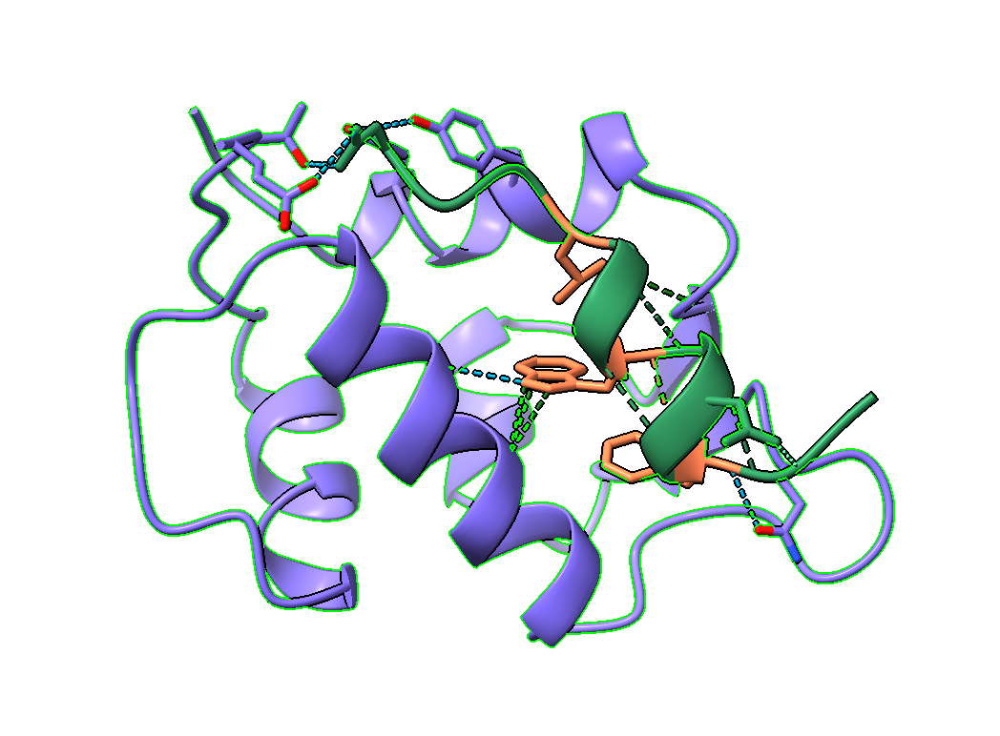
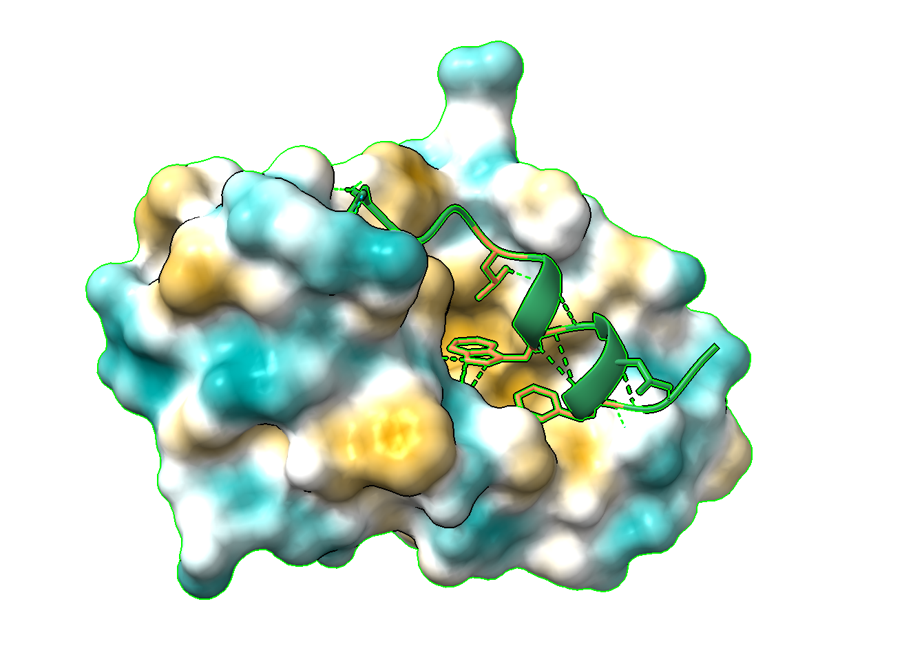
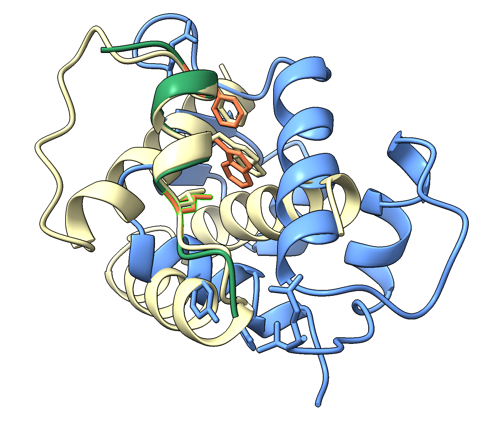

# Experiment 1: Motif Scaffolding of the p53 MDM2-Binding Helix

Date: 2026-05-31

## Objective

To evaluate whether RFdiffusion can generate a novel protein scaffold while preserving the key p53 MDM2-binding motif.

The p53 transactivation peptide contains a well-characterized alpha-helical binding motif that interacts with the hydrophobic cleft of MDM2. The goal of this experiment was to preserve the native motif geometry while generating a new supporting scaffold around the motif.

---

## Input Structure

Target complex:

- PDB: `1YCR`
- MDM2: chain `A`
- p53 peptide: chain `B`



Figure 1. Native `1YCR` target complex containing MDM2 and the bound p53 peptide.

Preserved motif:

```text
B17-29
ETFSDLWKLLPEN
```

Key binding residues:

```text
F19
W23
L26
```



Figure 2. Hydrophobic MDM2 binding surface around the canonical p53 motif residues.

These residues constitute the canonical p53 binding motif and are responsible for insertion into the MDM2 hydrophobic pocket.

---

## RFdiffusion Configuration

Task:

```text
Motif Scaffolding
```

Contig specification:

```text
20-40/B17-29/20-40
```

Interpretation:

- Generate 20-40 residues.
- Preserve motif `B17-29`.
- Generate an additional 20-40 residues.

The model was therefore constrained to retain the p53 motif while designing a novel scaffold around it.

---

## Sequence Design and Validation

For each RFdiffusion backbone:

- ProteinMPNN generated 8 candidate sequences.
- AlphaFold self-consistency validation was performed.
- Top-ranked candidates were selected based on AlphaFold confidence metrics.

Among the generated designs, Design 2 currently achieved the strongest validation scores.

Representative metrics:

- pLDDT approximately `0.90`
- pTM approximately `0.70`
- PAE approximately `3-4 Å`
- RMSD approximately `1 Å`

These results suggest that AlphaFold largely agrees with the RFdiffusion-generated backbone and predicts a stable folded structure.

Current best result:

- Design 2 is the best-performing result so far based on the available validation metrics.
- However, Design 2 still shows steric clash with MDM2 after structural alignment.
- Therefore, Design 2 is useful as the current leading example, but it is not yet a target-compatible design.

Top candidates and screenshots will be added later.

---

## Structural Analysis

The generated scaffold was aligned to the original p53 motif in `1YCR` using motif-based structural alignment.

Observations:

1. The preserved motif retained the expected alpha-helical geometry.

2. The key binding residues remained in approximately the same spatial locations and orientations as observed in the native p53-MDM2 complex:

```text
F19
W23
L26
```

3. The newly generated scaffold successfully preserved the functional motif but extended into regions occupied by MDM2.

4. Significant steric clashes were observed between the generated scaffold and the MDM2 surface after alignment.

Importantly, this behavior was observed across all top-ranked scaffold designs.



Figure 3. Best model clashed with MDM2, although aligned with p53.

The key motif residues are still preserved and point in the expected binding orientation. However, the newly generated scaffold region clashes with MDM2, indicating that the next design round needs to be target-aware rather than motif-only.

---

## Interpretation

The experiment demonstrates that RFdiffusion successfully preserved the specified motif geometry.

However, preservation of the motif alone was insufficient to guarantee compatibility with the target protein.

Because the scaffolding procedure was conditioned only on the motif and not on target exclusion constraints, the model frequently generated scaffold elements that occupied space already taken by MDM2.

Consequently:

```text
Motif Preservation: PASS

Target Compatibility: FAIL
```

The generated scaffolds appear structurally plausible in isolation but are not immediately compatible with the MDM2 binding environment.

---

## Next Steps

Potential improvements include:

1. Target-aware binder design using MDM2 hotspot residues.
2. Modified contig architectures to reduce scaffold growth toward the target surface.
3. Generation of larger scaffold libraries followed by clash-based filtering.
4. Target-conditioned motif scaffolding approaches that explicitly account for MDM2 geometry during generation.

---

## To Add Later

- Top candidate table.
- Screenshots of Design 2 and other top-ranked designs.
- Motif alignment figure.
- Clash visualization against MDM2.
- Notes on whether the clash is caused by scaffold topology, contig placement, or missing target-conditioning.
