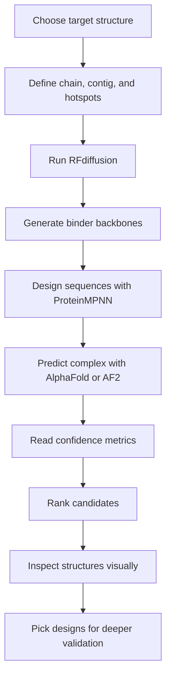

# RFdiffusion MDM2 Binder Design: Colab Metrics and Workflow

## Goal

Design a de novo binder against the MDM2 p53-binding pocket.

Target:

- MDM2 structure: `1YCR`
- Target chain: chain `A`
- Binding site: p53-binding pocket

Hotspots:

- `A54`
- `A61`
- `A62`
- `A67`
- `A86`
- `A91`

Contig:

- `A:70-100`

Meaning:

- Keep target residues 70-100 from chain `A` as the fixed target region.
- RFdiffusion generates a new binder around this target region.
- Hotspots tell RFdiffusion which target residues should be favored for binder contact.

---

## Big Picture Workflow

Most RFdiffusion binder-design Colab notebooks follow this logic:

The important idea is that RFdiffusion proposes a binder backbone, ProteinMPNN assigns amino-acid sequences to that backbone, and AlphaFold checks whether the designed sequence still folds and binds in the intended way.

---

## What Each Stage Produces

### 1. Target Setup

You provide:

- A protein structure, usually a PDB file or PDB ID.
- The target chain.
- The residue range or contig to keep fixed.
- Hotspot residues that define the desired binding patch.

For this project:

- Target: MDM2
- Chain: `A`
- Hotspots: `A54`, `A61`, `A62`, `A67`, `A86`, `A91`

The better the hotspot definition, the more likely RFdiffusion samples binders in the correct pocket.

### 2. RFdiffusion Backbone Generation

RFdiffusion generates binder backbone structures. At this stage, there may be no final amino-acid sequence yet.

Look for:

- Does the binder contact the target pocket?
- Is the binder compact and protein-like?
- Does it avoid obvious clashes with the target?
- Does it place secondary structure near the hotspots?

RFdiffusion output is a proposal, not proof that the binder will fold or bind.

### 3. ProteinMPNN Sequence Design

ProteinMPNN designs amino-acid sequences for the generated backbone.

One RFdiffusion backbone can have multiple designed sequences. That is why notebooks often show names like:

- `design_0_seq_0`
- `design_0_seq_1`
- `design_2_seq_3`

This means:

- `design_2`: the third RFdiffusion backbone.
- `sequence_3`: the fourth ProteinMPNN sequence designed for that backbone.

### 4. AlphaFold Validation

AlphaFold predicts whether the designed sequence forms the intended complex.

This is where the most important metrics appear:

- pLDDT
- PAE
- RMSD
- pTM
- sometimes ipTM or interface-specific scores

For binder design, AlphaFold is being used as a filter. A good candidate should both fold confidently and bind with low uncertainty.

---

## Metrics

### Abbreviation Glossary

| Abbreviation | Full name | Range or unit | Main use |
| --- | --- | --- | --- |
| pLDDT | predicted Local Distance Difference Test | `0-100` or sometimes normalized to `0-1` | Local per-residue structural confidence |
| PAE | Predicted Aligned Error | Angstroms | Relative domain, chain, or interface placement confidence |
| RMSD | Root Mean Square Deviation | Angstroms | Structural difference after alignment |
| TM-score | Template Modeling score | `0-1` | Global fold similarity |
| pTM | predicted Template Modeling score | `0-1` | Predicted global complex confidence |
| ipTM | interface predicted Template Modeling score | `0-1` | Predicted interface confidence |

Some notebooks report confidence values on a `0-1` scale, while others use a `0-100` scale. This is especially common for pLDDT.

Example:

- `pLDDT = 0.908` means about `90.8` if using the `0-1` scale.
- `PAE = 3.55` is usually already in Angstroms, written as $3.55\ \text{Å}$.
- `RMSD = 1.07` is usually in Angstroms, written as $1.07\ \text{Å}$.

When reading tables, first check the scale.

---

## pLDDT

Full name:

- predicted Local Distance Difference Test.

Question:

- Does the binder fold into a locally well-defined structure?

Formal meaning:

- LDDT measures whether local inter-atomic distances around a residue are predicted correctly.
- pLDDT is AlphaFold's predicted version of this score.
- It is reported per residue, then often averaged over a chain or whole complex.
- It is a local confidence metric, not a binding metric.

Simplified LDDT definition:

For residue or atom `i`, compare distances from `i` to neighboring atoms or residues `j`.

$$
\Delta_{ij}
=
\left|d_{ij}^{\mathrm{pred}} - d_{ij}^{\mathrm{true}}\right|
$$

$$
\mathrm{LDDT}_i =
\frac{1}{4N_i}
\sum_{j \in \mathcal{N}(i)}
\sum_{\tau \in \{0.5, 1, 2, 4\}\ \text{Å}}
\mathbf{1}\left(\Delta_{ij} < \tau\right)
$$

Where:

- $\Delta_{ij}$ is the absolute distance error for the pair $(i, j)$.
- $d_{ij}^{\mathrm{pred}}$ is the predicted distance between residues or atoms $i$ and $j$.
- $d_{ij}^{\mathrm{true}}$ is the true distance in an experimental reference structure.
- $\tau$ is one of the four LDDT distance-error thresholds: $0.5$, $1$, $2$, or $4\ \text{Å}$.
- $\mathbf{1}(\cdot)$ is an indicator function: `1` if true, `0` if false.
- $\mathcal{N}(i)$ is the set of local neighbors considered for residue or atom $i$.
- $N_i = |\mathcal{N}(i)|$ is the number of those neighbors.

Because the true structure is unknown for a new design, AlphaFold predicts this value, giving pLDDT.

Interpretation:

| pLDDT, 0-100 scale | pLDDT, 0-1 scale | Meaning |
| --- | --- | --- |
| `>90` | `>0.90` | Excellent |
| `80-90` | `0.80-0.90` | Good |
| `70-80` | `0.70-0.80` | Usable but inspect carefully |
| `<70` | `<0.70` | Concerning |

Academic interpretation:

- High pLDDT means the local geometry is predicted to be reliable.
- Low pLDDT often corresponds to disorder, flexibility, bad sequence-backbone compatibility, or uncertain loop conformations.
- pLDDT does not evaluate whether the binder is in the correct position relative to the target.

How to use it:

- Check binder pLDDT specifically, not only whole-complex pLDDT.
- A high target pLDDT can hide a weak binder if the target structure is easy to predict.
- For de novo binders, prefer candidates where the binder itself has high pLDDT.

Good sign:

- The designed binder has pLDDT above `0.85` or `85`.

Bad sign:

- The target is confident, but the binder is low confidence or disordered.

---

## PAE

Full name:

- Predicted Aligned Error.

Question:

- Does AlphaFold predict a confident relative orientation between the binder and target?

Formal meaning:

- PAE is a pairwise error estimate between residues.
- `PAE(i, j)` estimates the positional error at residue `j` when the predicted and true structures are aligned on residue `i`.
- PAE is asymmetric in principle: `PAE(i, j)` and `PAE(j, i)` do not have to be identical.
- Units are Angstroms.

Definition:

$$
\mathrm{PAE}(i, j)
= \mathbb{E}\left[
\text{position error of residue } j
\text{ after alignment on residue } i
\right]
$$

More explicitly:

Let $\tilde{\mathbf{x}}_{j|i}^{\mathrm{pred}}$ and $\tilde{\mathbf{x}}_{j|i}^{\mathrm{true}}$ be the predicted and true coordinates of residue $j$ after alignment on residue $i$.

$$
e_{ij}
=
\operatorname{dist}
\left(
\tilde{\mathbf{x}}_{j|i}^{\mathrm{pred}},
\tilde{\mathbf{x}}_{j|i}^{\mathrm{true}}
\right)
$$

$$
\mathrm{PAE}(i, j)
\approx
\mathbb{E}\left[e_{ij}\right]
$$

Where:

- $\mathbf{x}_j$ is the 3D coordinate of residue $j$, usually represented by the C-alpha atom for proteins.
- $\tilde{\mathbf{x}}_{j|i}$ means the coordinate of residue $j$ after the structures have been aligned using residue $i$.
- $e_{ij}$ is the aligned position error for residue $j$ under alignment on residue $i$.
- $\operatorname{dist}(a,b)$ is the Euclidean distance between two 3D coordinates.
- The expectation reflects AlphaFold's uncertainty estimate, not a direct experimental measurement.

For binder design:

- Intra-chain PAE tells you whether AlphaFold is confident about the internal fold of a chain.
- Inter-chain PAE tells you whether AlphaFold is confident about the relative placement of two chains.
- Interface PAE is the relevant part for binder-target confidence.

Interpretation:

| PAE | Meaning |
| --- | --- |
| `<5` | Excellent |
| `5-10` | Reasonable |
| `10-15` | Weak or uncertain |
| `>15` | Usually poor for binder design |

Academic interpretation:

- Low intra-binder PAE means the binder's internal residue placement is predicted confidently.
- Low binder-target PAE means the binder's placement relative to the target is predicted confidently.
- A design can have high pLDDT and high interface PAE. This means the binder may fold, but its binding pose is uncertain.

Most important point for binder design:

- Interface PAE is usually more important than global average PAE.
- Use the target-binder block of the PAE matrix, not only a single global summary value.

How to read a PAE plot:

- Low PAE within the binder block means the binder fold is internally confident.
- Low PAE between target and binder blocks means the target-binder orientation is confident.
- High PAE between target and binder blocks means the interface is uncertain.

Good sign:

- The target-binder off-diagonal region is dark or low-valued.

Bad sign:

- Binder pLDDT is high, but target-binder PAE is high.

That usually means the binder may fold but may not bind the intended site.

---

## RMSD

Full name:

- Root Mean Square Deviation.

Question:

- Does the AlphaFold-predicted structure remain close to the RFdiffusion-designed structure?

Formal meaning:

- RMSD measures average coordinate deviation between two structures after alignment.
- It is usually computed over matched atoms, often backbone atoms or C-alpha atoms.
- Units are Angstroms.

Definition:

$$
\mathrm{RMSD}
=
\sqrt{
\frac{1}{N}
\sum_{i=1}^{N}
\left\|
\mathbf{x}_i - \mathbf{y}_i
\right\|_2^2
}
$$

Where:

- $N$ is the number of matched atoms or residues.
- $\mathbf{x}_i$ is the coordinate of atom or residue $i$ in structure 1.
- $\mathbf{y}_i$ is the coordinate of the corresponding atom or residue in structure 2.
- The structures are usually first optimally superimposed by rotation and translation.

In this notebook context:

$$
\mathrm{RMSD}_{\mathrm{design}}
=
\mathrm{RMSD}
\left(
\text{RFdiffusion backbone},
\text{AlphaFold-predicted backbone}
\right)
$$

Interpretation:

| RMSD | Meaning |
| --- | --- |
| `<1` | Excellent |
| `1-2` | Good |
| `2-4` | Inspect carefully |
| `>4` | Concerning |

Academic interpretation:

- Low RMSD means the designed sequence is compatible with the RFdiffusion backbone according to AlphaFold.
- High RMSD means AlphaFold predicts a different structure than the one RFdiffusion generated.
- RMSD is sensitive to which atoms are included and how the structures are aligned.

How to use it:

- Low RMSD means the sequence likely supports the designed backbone.
- High RMSD means ProteinMPNN sequence plus AlphaFold prediction drifted away from the RFdiffusion design.

Good sign:

- RMSD around `1.0` Angstrom or lower.

Bad sign:

- The binder moves away from the pocket after AlphaFold prediction.

---

## pTM

Full name:

- predicted Template Modeling score.

Question:

- Is the global topology of the predicted complex likely to be correct?

Background:

- TM-score is a length-normalized measure of structural similarity.
- It was designed to be less sensitive to protein length than RMSD.
- AlphaFold's pTM is a predicted TM-score-like confidence estimate.

TM-score definition:

$$
\mathrm{TM\text{-}score}
=
\max_{\text{superpositions}}
\left[
\frac{1}{L_{\mathrm{ref}}}
\sum_{i=1}^{L_{\mathrm{aligned}}}
\frac{1}{
1 + \left(\frac{d_i}{d_0(L_{\mathrm{ref}})}\right)^2
}
\right]
$$

Where:

- $d_i$ is the distance between aligned residue $i$ in the two structures.
- $L_{\mathrm{ref}}$ is the reference protein length.
- $d_0(L_{\mathrm{ref}})$ is a length-dependent normalization term.

A commonly used form of `d0` is:

$$
d_0(L)
=
1.24\sqrt[3]{L - 15} - 1.8
$$

For AlphaFold:

- pTM is the model's predicted estimate of TM-score.
- It summarizes confidence in global residue-residue arrangement.
- It is useful for complexes, but it is not specifically an interface score.

Interpretation:

| pTM | Meaning |
| --- | --- |
| `>0.8` | Strong global confidence |
| `0.6-0.8` | Moderate confidence |
| `<0.6` | Weak global confidence |

Academic interpretation:

- pTM is more global than pLDDT.
- pTM is usually more informative than average pLDDT for domain arrangement.
- For binder design, pTM can be diluted by the target structure and may not isolate the interface.

How to use it:

- Treat pTM as a supporting metric.
- Do not select binders by pTM alone.
- A design with moderate pTM but excellent interface PAE can still be worth inspecting.

---

## ipTM, If Available

Full name:

- interface predicted Template Modeling score.

Question:

- Is the predicted target-binder interface reliable?

Formal meaning:

- ipTM is an interface-focused variant of pTM.
- It emphasizes confidence in the relative placement of residues across different chains.
- It is especially useful for protein complexes and binder design.

Conceptual definition:

$$
\mathrm{ipTM}
\approx
\text{predicted TM-score contribution from inter-chain residue pairs}
$$

In a target-binder complex:

$$
\mathrm{ipTM}
=
\text{confidence in the target-chain to binder-chain arrangement}
$$

This is not the same as binding affinity. A high ipTM means the model is confident in the predicted interface geometry, not that the binder definitely binds strongly in experiment.

Interpretation:

| ipTM | Meaning |
| --- | --- |
| `>0.8` | Strong interface confidence |
| `0.6-0.8` | Promising |
| `<0.6` | Weak interface confidence |

Academic interpretation:

- ipTM is usually more relevant than pTM for multimeric complexes.
- For RFdiffusion binders, ipTM and interface PAE should usually agree.
- A high ipTM with low interface PAE is a strong computational signal.

If the notebook reports ipTM, use it together with interface PAE.

Good candidate pattern:

- High binder pLDDT
- Low interface PAE
- Low RMSD
- High or reasonable ipTM

---

## How to Rank Binder Candidates

Use this order:

1. Remove obvious failures.
2. Prioritize low interface PAE.
3. Check binder pLDDT.
4. Check RMSD to the RFdiffusion design.
5. Check pTM or ipTM.
6. Visually inspect the structure.

Practical filter:

| Metric | Strong Candidate |
| --- | --- |
| Binder pLDDT | `>0.85` or `>85` |
| Interface PAE | `<5` |
| RMSD | `<2` |
| pTM | `>0.6` |
| ipTM, if available | `>0.6` |

The best designs are not just high-scoring in one metric. They should be consistent across several metrics.

---

## Visual Inspection Checklist

After selecting top candidates, inspect the structures in PyMOL, ChimeraX, ColabFold viewer, or another molecular viewer.

Check:

- Does the binder sit in the MDM2 p53-binding pocket?
- Does it contact the hotspot residues?
- Are there obvious steric clashes?
- Is the binder compact?
- Does the interface have enough contact area?
- Are hydrophobic residues buried at the interface?
- Are polar residues making reasonable hydrogen bonds or salt bridges?
- Does the binder have dangling loops with low confidence?

Metrics can rank candidates, but visual inspection catches geometry problems.

---

## Example Candidate

### Design 2 / Sequence 3

Metrics:

| Metric | Value | Interpretation |
| --- | ---: | --- |
| pLDDT | `0.908` | Excellent, about `90.8` on the `0-100` scale |
| pTM | `0.741` | Moderate to good global confidence |
| PAE | `3.55` | Excellent interface confidence if this is interface PAE |
| RMSD | `1.07` | Good agreement with RFdiffusion design |

Notes:

- Strong AlphaFold confidence.
- Low interface uncertainty.
- RFdiffusion and AlphaFold mostly agree.
- Candidate selected for structural inspection.

Why this looks promising:

- `pLDDT = 0.908` suggests the binder is likely to fold well.
- `PAE = 3.55` suggests AlphaFold is confident about the binder's placement against MDM2.
- `RMSD = 1.07` suggests the final predicted structure is close to the designed backbone.
- `pTM = 0.741` supports the overall complex prediction, although it is not the main binder-design metric.

Next step:

- Open the predicted complex and inspect whether the binder contacts `A54`, `A61`, `A62`, `A67`, `A86`, and `A91`.

---

## Common Failure Patterns

### High pLDDT, High PAE

Meaning:

- The binder probably folds.
- AlphaFold is uncertain where it binds.

Decision:

- Usually not a top binder candidate.
- Inspect only if other metrics or geometry look unusually good.

### Low pLDDT, Low PAE

Meaning:

- AlphaFold may place the binder near the target, but the binder itself is not confidently folded.

Decision:

- Risky.
- Usually deprioritize.

### Low RMSD, High Interface PAE

Meaning:

- AlphaFold agrees with the designed binder shape, but not necessarily with the binding mode.

Decision:

- Check whether PAE is global or interface-specific.
- If interface PAE is high, deprioritize.

### Good Scores, Bad Geometry

Meaning:

- Metrics are promising, but the physical interface may still be poor.

Examples:

- Binder touches the wrong side of MDM2.
- Interface is too small.
- Hotspots are not contacted.
- Binder has clashes.
- Important residues point away from the target.

Decision:

- Visual inspection is required before trusting the candidate.

---

## Simple Decision Rule

For each candidate, ask:

1. Does the binder fold?
   - Check binder pLDDT.
2. Does the binder bind in a confident orientation?
   - Check interface PAE.
3. Does the sequence preserve the RFdiffusion design?
   - Check RMSD.
4. Is the whole complex reasonable?
   - Check pTM or ipTM.
5. Does the structure make chemical sense?
   - Inspect the 3D model.

If all five answers are yes, the candidate is worth deeper analysis.

---

## Short Summary

- pLDDT answers: does the binder fold?
- PAE answers: does AlphaFold know where the binder binds?
- RMSD answers: does AlphaFold agree with the RFdiffusion design?
- pTM answers: is the global complex prediction reasonable?
- ipTM answers: is the interface reliable, if reported?

For binder design, prioritize:

1. Low interface PAE.
2. High binder pLDDT.
3. Low RMSD.
4. Good visual interface geometry.

---

## Reference Concepts

These are the main academic concepts behind the notebook metrics:

- LDDT: local distance difference test, a superposition-free local structure accuracy score.
- pLDDT: AlphaFold's predicted estimate of LDDT, used as a per-residue confidence score.
- PAE: AlphaFold's predicted aligned error, used to estimate uncertainty in relative residue, domain, or chain placement.
- RMSD: root mean square deviation, a standard coordinate deviation after structural alignment.
- TM-score: template modeling score, a length-normalized global fold similarity score.
- pTM: AlphaFold's predicted estimate of TM-score.
- ipTM: AlphaFold-Multimer's interface-focused predicted TM-score for complexes.

Useful papers to know:

- Mariani et al., 2013: LDDT.
- Zhang and Skolnick, 2004: TM-score.
- Jumper et al., 2021: AlphaFold.
- Evans et al., 2021 / 2022: AlphaFold-Multimer.
